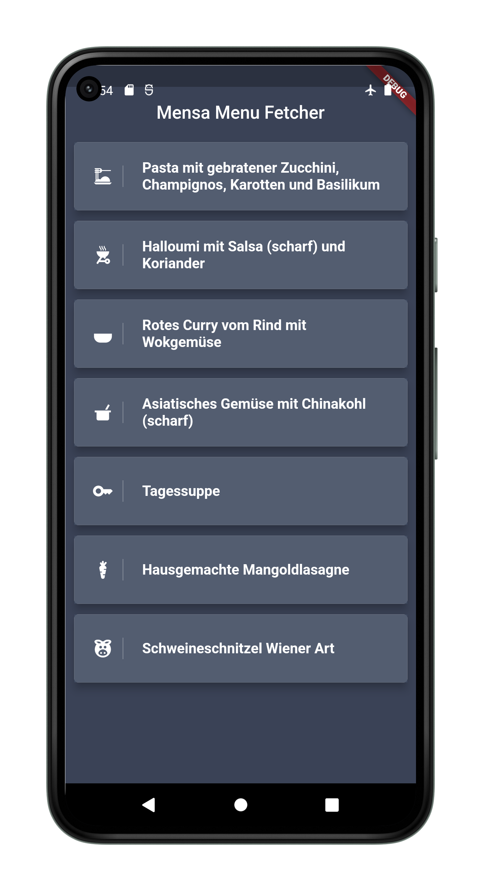

# Mensa Bot

As a hungry student I am always annoyed how poor the internet connection is whilst going from a lecture to the mensa (german for cafeteria). 

As such I wanted a way to fetch the menu for the day in advance and present it in a nice user interface.

## Screenshots

## Features

- Cross platform
- Offline use
- Periodic menu fetching
- Nice UI
- Parsing of the mensa webpage to get the current menu

## Lessons Learned

Cross platform app development is hard. This project started as a PWA turned into a expo app, but all the while the background fetching was extremely cumbersome and unreliable.

Only with Flutter the system worked properly.

- Take more time to scout solutions instead of blindly commiting
- Do not try to make a pretty UI before perfecting the functionality
